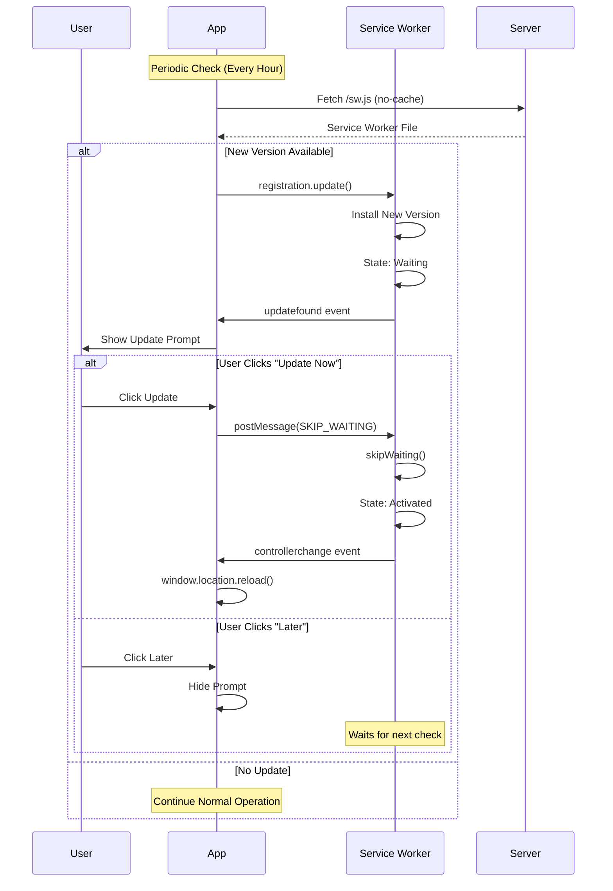

# Service Worker Update Strategy

This document explains the service worker update strategy implemented for Kurama PWA.

## Overview

The update strategy ensures users always have the latest version of the app while providing a smooth update experience with user control.

## Key Features

### 1. Periodic Update Checks
- **Frequency**: Every 1 hour
- **Method**: Fetches service worker file with cache-busting headers
- **Smart Checks**: Skips checks when offline or update already in progress

### 2. Lifecycle Management
- **Install**: Service worker downloads and installs in background
- **Waiting**: New version waits for user approval before activating
- **Activate**: Takes control after user clicks "Update Now"
- **Controller Change**: Page reloads automatically to use new version

### 3. User-Friendly Updates
- **Update Prompt**: Shows notification when update is available
- **User Control**: "Update Now" or "Later" options
- **No Interruption**: Updates don't interrupt current work
- **Automatic Reload**: Page reloads only after user approval

## Implementation

### Update Strategy Configuration

Located in `src/lib/sw-update-strategy.ts`:

```typescript
setupUpdateStrategy({
  updateInterval: 60 * 60 * 1000, // 1 hour
  immediateCheck: true,
  autoSkipWaiting: false, // Requires user action
  onUpdateReady: (registration) => {
    // Show update prompt
  },
})
```

### Service Worker Message Handler

Located in `src/sw.ts`:

```typescript
self.addEventListener('message', (event) => {
  if (event.data && event.data.type === 'SKIP_WAITING') {
    self.skipWaiting()
  }
})
```

### Update Prompt Component

Located in `src/components/pwa/update-prompt.tsx`:

- Displays when update is available
- Provides "Update Now" and "Later" buttons
- Sends SKIP_WAITING message to service worker
- Automatically reloads page after activation

## Update Flow



## Configuration Options

### UpdateStrategyConfig

```typescript
interface UpdateStrategyConfig {
  // Interval for periodic checks (default: 1 hour)
  updateInterval?: number
  
  // Check immediately on registration (default: true)
  immediateCheck?: boolean
  
  // Skip waiting automatically (default: false)
  autoSkipWaiting?: boolean
  
  // Callback when update is found
  onUpdateFound?: (registration) => void
  
  // Callback when update is ready
  onUpdateReady?: (registration) => void
  
  // Callback when first install completes
  onUpdateInstalled?: () => void
}
```

### Recommended Settings

**Production** (Current):
```typescript
{
  updateInterval: 60 * 60 * 1000, // 1 hour
  immediateCheck: true,
  autoSkipWaiting: false, // User approval required
}
```

**Development**:
```typescript
{
  updateInterval: 5 * 60 * 1000, // 5 minutes
  immediateCheck: true,
  autoSkipWaiting: true, // Auto-update for faster iteration
}
```

**Critical Updates**:
```typescript
{
  updateInterval: 15 * 60 * 1000, // 15 minutes
  immediateCheck: true,
  autoSkipWaiting: true, // Force immediate updates
}
```

## API Reference

### setupUpdateStrategy()

Sets up the update strategy with periodic checks and lifecycle handlers.

```typescript
const cleanup = setupUpdateStrategy(config)

// Later, cleanup when component unmounts
cleanup()
```

### triggerUpdate()

Manually trigger an update check (useful for "Check for Updates" buttons).

```typescript
const success = await triggerUpdate()
if (success) {
  console.log('Update check triggered')
}
```

### skipWaiting()

Activate waiting service worker immediately.

```typescript
skipWaiting(registration)
```

### isUpdateAvailable()

Check if an update is currently waiting.

```typescript
const hasUpdate = await isUpdateAvailable()
if (hasUpdate) {
  // Show update prompt
}
```

## Best Practices

### 1. Don't Auto-Update Without User Consent
❌ **Bad**: `autoSkipWaiting: true` in production
✅ **Good**: Show prompt and let user decide

### 2. Check for Updates Regularly
❌ **Bad**: Only check on page load
✅ **Good**: Periodic checks every hour

### 3. Handle Offline Gracefully
❌ **Bad**: Try to update when offline
✅ **Good**: Skip update checks when offline

### 4. Reload After Activation
❌ **Bad**: Let user continue with old version
✅ **Good**: Reload automatically after activation

### 5. Provide Clear Messaging
❌ **Bad**: "New version available"
✅ **Good**: "Une nouvelle version de l'application est disponible"

## Testing

### Manual Testing

1. **Initial Install**:
   - Open app in incognito mode
   - Verify service worker installs
   - Check console for install logs

2. **Update Flow**:
   - Make changes to app code
   - Build and deploy
   - Wait for periodic check or trigger manually
   - Verify update prompt appears
   - Click "Update Now"
   - Verify page reloads with new version

3. **Offline Behavior**:
   - Go offline
   - Wait for update check interval
   - Verify no update attempts when offline
   - Go back online
   - Verify update check resumes

### Automated Testing

```typescript
// Test update detection
test('detects service worker update', async () => {
  const onUpdateReady = jest.fn()
  
  setupUpdateStrategy({
    onUpdateReady,
    immediateCheck: false,
  })
  
  // Simulate update
  await triggerUpdate()
  
  expect(onUpdateReady).toHaveBeenCalled()
})
```

## Troubleshooting

### Update Not Detected

**Symptoms**: New version deployed but update prompt doesn't appear

**Solutions**:
1. Check service worker is registered: DevTools > Application > Service Workers
2. Verify cache headers: Service worker should have `Cache-Control: no-cache`
3. Manually trigger update: `await triggerUpdate()`
4. Check console for update check logs

### Update Prompt Appears Too Often

**Symptoms**: Prompt shows on every page load

**Solutions**:
1. Verify `updateInterval` is set correctly (should be 1 hour)
2. Check service worker file isn't changing unnecessarily
3. Ensure build process generates consistent service worker

### Page Doesn't Reload After Update

**Symptoms**: User clicks "Update Now" but page doesn't reload

**Solutions**:
1. Verify `controllerchange` event listener is registered
2. Check service worker receives SKIP_WAITING message
3. Ensure `skipWaiting()` is called in service worker
4. Check browser console for errors

### Updates Fail When Offline

**Symptoms**: Update checks fail with network errors

**Solutions**:
1. Verify offline detection: `if (!navigator.onLine) return`
2. Check update strategy skips checks when offline
3. Ensure error handling catches network failures

## Monitoring

### Key Metrics

Track these metrics to monitor update effectiveness:

1. **Update Detection Rate**: % of users who see update prompt
2. **Update Acceptance Rate**: % who click "Update Now" vs "Later"
3. **Update Latency**: Time from deployment to user update
4. **Update Errors**: Failed update attempts

### Logging

Enable detailed logging in development:

```typescript
// In sw-update-strategy.ts
console.log('[SW Update] Checking for updates...')
console.log('[SW Update] Update found')
console.log('[SW Update] Update ready')
```

### Analytics

Track update events:

```typescript
setupUpdateStrategy({
  onUpdateReady: (registration) => {
    // Track update available
    analytics.track('sw_update_available')
  },
})

// Track user action
function handleUpdate() {
  analytics.track('sw_update_accepted')
  skipWaiting(registration)
}
```

## Resources

- [Service Worker Lifecycle](https://developers.google.com/web/fundamentals/primers/service-workers/lifecycle)
- [Workbox Update Strategies](https://developer.chrome.com/docs/workbox/handling-service-worker-updates)
- [Vite PWA Plugin](https://vite-pwa-org.netlify.app/guide/periodic-sw-updates)
- [MDN: Service Worker API](https://developer.mozilla.org/en-US/docs/Web/API/Service_Worker_API)
